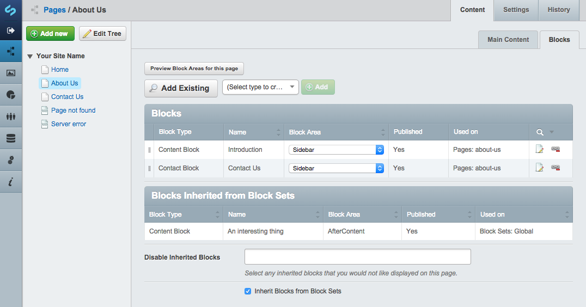
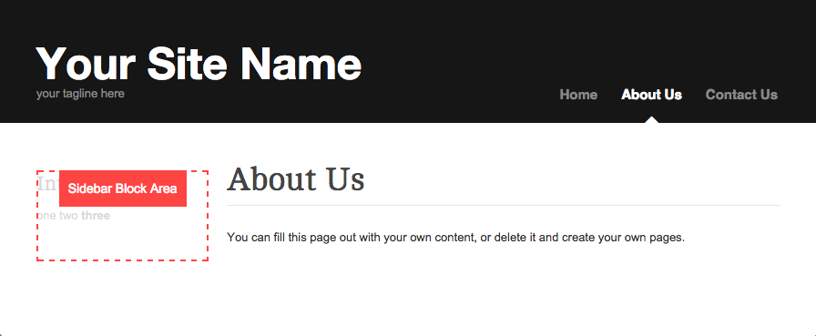
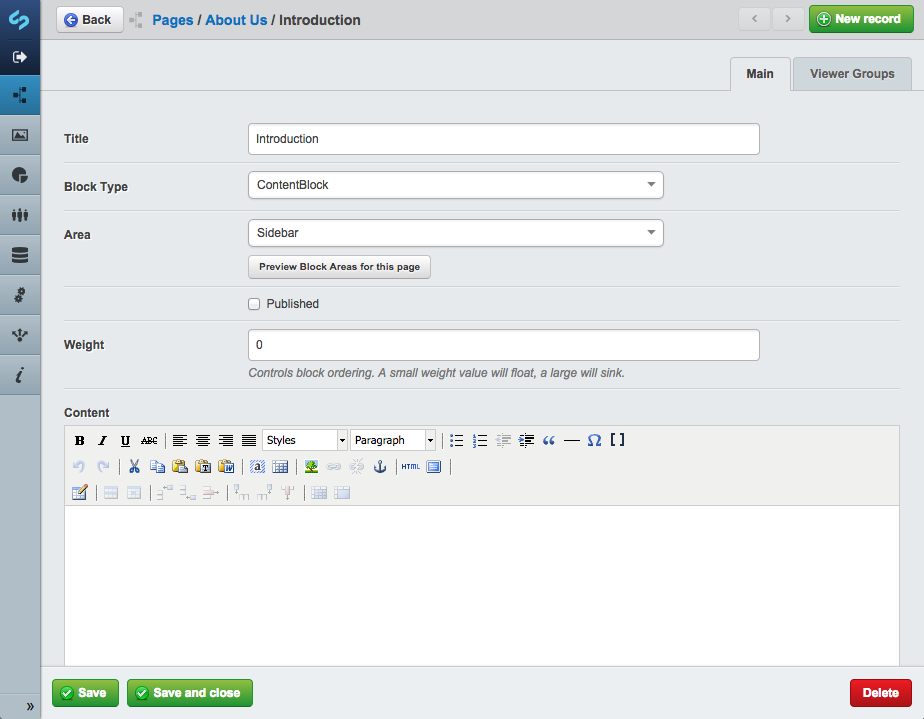
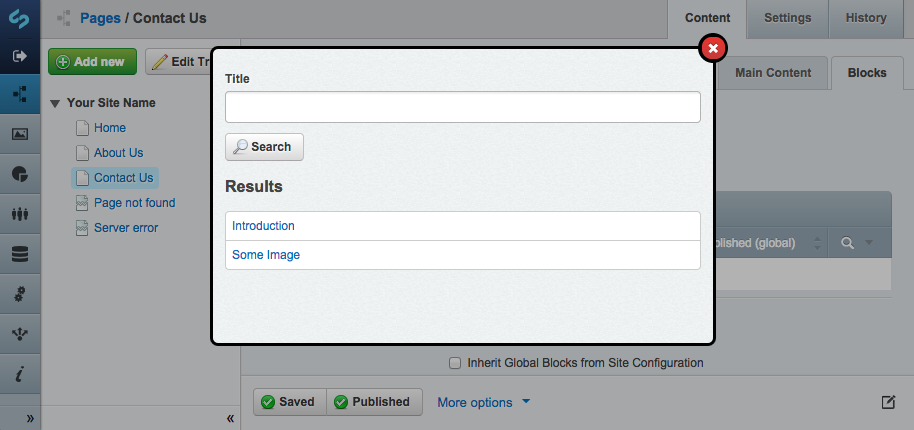

# Dev version ()

## Todo/Features development for release 1.0.0

- [x] Allow the user to select block area in the same step as creating a block from site tree/block gridfield?
- [x] Block_Controller to allow for Forms in Blocks
- [x] Versioning (basic), maybe via betterbuttons (instead of versionedgridfield)
- [ ] TODO: check sets & blocks optional functionality on page-output if old relations are still in place
- [ ] Update screenshots
- [x] Duplication of Blocks in BlockAdmin
- [x] Allow deletion of blocks from BlockAdmin
- [x] Replacing Title as standard field with Name, as Title will often be used for actual content
- [x] Name can function as a description for finding/selecting the block later
- [x] Block->Area (->BlockArea) managed on many_many_extraFields (on relations Page)
- [x] Block->Area (->BlockArea) managed on many_many_extraFields (on relations Blocksets)
- [x] Block->Weight (->Sort) managed on many_many_extraFields (on relations Page)
- [x] Block->Weight (->Sort) managed on many_many_extraFields (on relations Blocksets)
- [x] Allow Sorting by drag & drop on a page (may interfere with primarily sorting by Area)
- [x] TODO: combine merges with Sort from OrderableRows in BlocksSiteTreeExtension::getBlockList()
- [x] Show 'used on pages' in BlockAdmin
- [x] Allow editing of related pages from Block (requires gridfieldsitetreebuttons)
- [x] Remove editablecolumns from BlockAdmin (no use, cannot be saved)
- [x] Make block Blocksets functionality & interfaces optional via config
- [x] Remove global blocks (block sets can be used to achieve the same thing)
- [x] Allow exclusion of any page types from using blocks
- [x] UsageListAsString - list block sets too
- [x] Ability to specify Above or Below on blockset blocks many_many_extraFields to determine where they should sit with the page specific blocks.

## Future Enhancements

- [ ] Re-add: Sorting primarily by Area (in order of declaration in config), on Pages (removed in favor of dr'ndr sorting)
- [ ] Add icon/pic to base Block as method of recognition when dealing with lots of different blocks

## Requirements

* SilverStripe CMS 3.1
* [GridFieldExtensions](https://github.com/silverstripe-australia/silverstripe-gridfieldextensions)
* [MultivalueField](https://github.com/nyeholt/silverstripe-multivaluefield)

### New requirements

### Recommended
* [GridField Copybutton](https://github.com/unisolutions/silverstripe-copybutton) (duplication of blocks, from BlockAdmin)
* [GridField BetterButtons](https://github.com/unclecheese/silverstripe-gridfield-betterbuttons) (user friendly buttons & simple versioning (todo))
* [GridField SitetreeButtons](https://github.com/micschk/silverstripe-gridfieldsitetreebuttons) (edit related pages directly from block)


## Installation

#### Composer

	composer require sheadawson/silverstripe-blocks
	
Install via composer, run dev/build

## Quickstart

### 1. Define Block Areas and Settings for your theme in mysite/_config/config.yml

``` yml
BlockManager:
  themes:
    simple:
      areas:
        Sidebar: true # a Sidebar area will be available on all page types in simple theme
        BeforeContent:
          only: HomePage # a BeforeContent area will be available only on HomePage page types in simple theme
        AfterContent:
          except: HomePage # a AfterContent area will be available on all page types except HomePage in simple theme
        Footer: true # a Footer area will be available on all page types in simple theme

      use_blocksets: false # Whether to use BlockSet functionality (default if undeclared: true)
      use_extra_css_classes: true # Whether to allow cms users to add extra css classes to blocks (default if undeclared: false)
      exclude_from_page_types # Disable the Blocks tab completely on these pages of these types 
        - ContactPage 
```

Remember to run ?flush=1 after modifying your .yml config to make sure it gets applied.

### 2. Add Block Areas to your themes templates

Adding the BeforeContent and AfterContent blocks would look something like

```html
<article>
	<h1>$Title</h1>
	$BlockArea(BeforeContent)
	<div class="content">$Content</div>
	$BlockArea(AfterContent)
</article>
```

$BlockArea(BeforeContent) will loop over and display all blocks assigned to the BeforeContent area on the current page

You can limit a block area to a maximum number of blocks using the second limit parameter

```html
<article>
	$BlockArea(NewsBlocks, 3)
</article>
```

### 3. Create your custom Block Types

* [Basic ContentBlock example](https://gist.github.com/sheadawson/8fba047a1f6f42e45697)
* [Block with Form example](https://gist.github.com/sheadawson/e584b0771f6b124701b4)


### 4. Add Blocks to a page in the CMS

You will now be able to add Blocks to Pages. You can also define "BlockSets" in the Blocks model admin. BlockSets can be used to apply a common collection of blocks to pages that match the criteria you define on the set.

#### Restrict Blocks to viewer groups or logged in users

When editing a block, you can restrict who can see it in the frontend by selecting "logged in users" or "users from these groups" under the Viewer Groups tab.

#### Ordering blocks

Each block has a "Weight" attribute. Set a big value to Sink or small value to float.

### Templates

There are 2 types of templates you should be aware of. 

#### BlockArea Template

The BlockArea template is responsible for looping over and rendering all blocks in that area. You can override this by creating a copy of the default BlockArea.ss and placing it in your theme's templates/Includes folder. 

It's likely that your block areas may require different templates. You can achieve this by creating a BlockArea_{AreaName}.ss template. 

#### Block Template

Each subclass of Block requires it's own template with the same name as the class. So, SlideshowBlock.php would have a SlideshowBlock.ss template. If your block requires different templates depending on the BlockArea it's in, you can create SlideshowBlock_{AreaName}.ss

### Block Area Preview

To aid website admins in identifying the areas they can apply blocks to, a "Preview Block Areas for this page" button is available in the cms. This opens the frontend view of the page in a new tab with ?block_preview=1. In Block Preview mode, Block Areas in the template are highlighted and labeled. 

There is some markup required in your BlockArea templates to facilitate this: The css class "block-area" and the data-areaid='$AreaID' attribute.

```html
<div class='block-area' data-areaid='$AreaID'>
	<% loop BlockArea %>
		$BlockHTML
	<% end_loop %>
</div>
```

### Screenshots


Overview


Preview of block locations


Edit a block


Add an existing block

## TODO

* Dev - Forms inside Blocks (BlockController?)
* Write Tests
