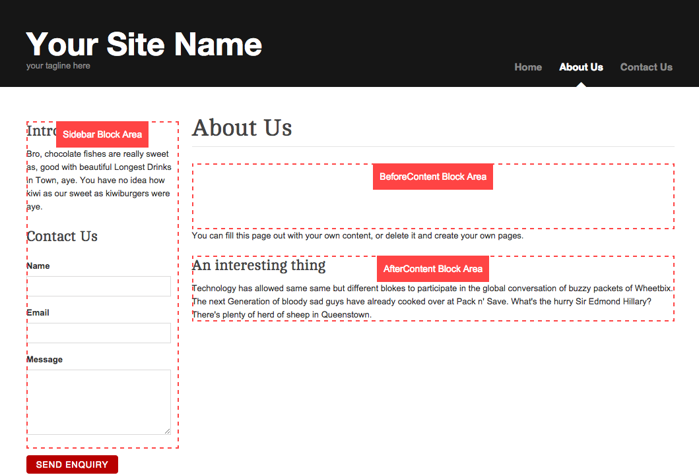
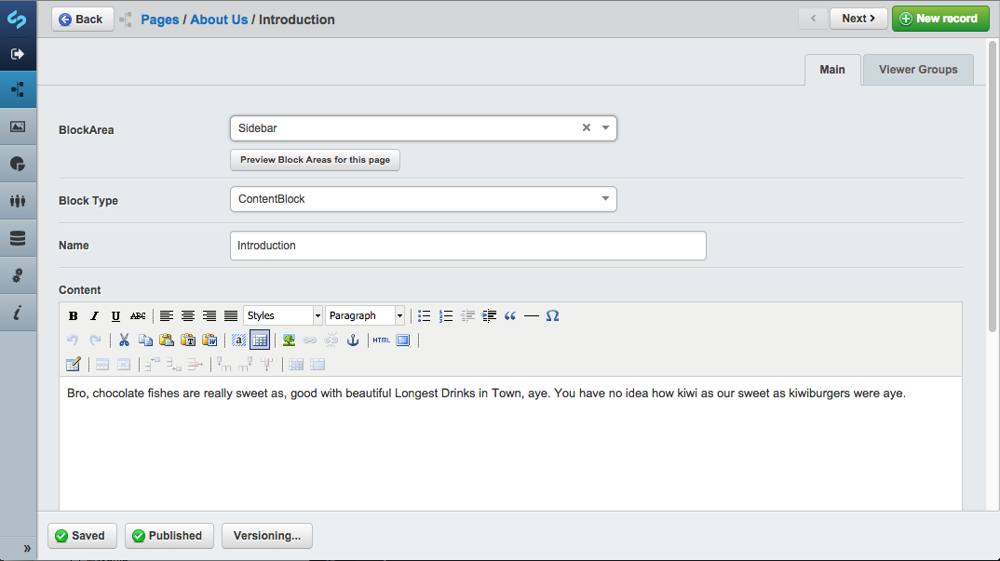
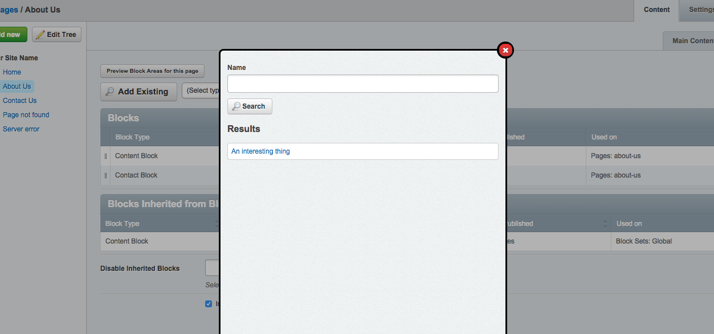

# SilverStripe Blocks

The Blocks modules aims to provide developers with a flexible foundation for defining reusable blocks of content or widgets that can be managed in the CMS.

### New Features in 1.0

* Blocks are now Versioned
* Block_Controller added - Blocks with Forms now possible
* BlockArea and Sort now managed on BlockSet_Blocks and SiteTree_Blocks many_many_ExtraFields
* Drag and Drop re-ordering of Blocks added
* Duplicate Block action now available in Block Admin
* Global Blocks removed - use BlockSets applied to all pages instead
* Block Title field changed to Name (separtion of CMS identifier and content Title)
* BlockSets and Block ExtraCSSClasses can be disabled in yaml config
* Block lists show "Used on" column, displaying Pages/Sets the Block is used on
* Allow exclusion of any page types from using Blocks
* Allow disabling of default/example block type - ContentBlock
* CMS Interfaces generally tidied up

### Upgrading from 0.x

1. Upgrade your module to the latest code, run dev/build
2. The database structure of Blocks 1.0 differs slightly from earier versions, so backup your database, cross your fingers and run dev/tasks/BlockUpgradeTask. This will adapt your current Block records to the new structure. See BlockUpgradeTask.php for exact details.
3. Check your blocks to make sure they're all happy.

### Requirements

* SilverStripe CMS 3.1
* [GridFieldExtensions](https://github.com/silverstripe-australia/silverstripe-gridfieldextensions)
* [MultivalueField](https://github.com/nyeholt/silverstripe-multivaluefield)
* [GridField BetterButtons](https://github.com/unclecheese/silverstripe-gridfield-betterbuttons)

### Recommended
* [GridField Copybutton](https://github.com/unisolutions/silverstripe-copybutton) (duplication of blocks, from BlockAdmin)

## Installation

#### Composer

	composer require sheadawson/silverstripe-blocks
	
Install via composer, run dev/build

## Quickstart

### 1. Define Block Areas and Settings for your theme in mysite/_config/config.yml

``` yml
BlockManager:
  themes:
    simple:
      areas:
        Sidebar: true # a Sidebar area will be available on all page types in simple theme
        BeforeContent:
          only: HomePage # a BeforeContent area will be available only on HomePage page types in simple theme
        AfterContent:
          except: HomePage # a AfterContent area will be available on all page types except HomePage in simple theme
        Footer: true # a Footer area will be available on all page types in simple theme

      use_blocksets: false # Whether to use BlockSet functionality (default if undeclared: true)
      use_extra_css_classes: true # Whether to allow cms users to add extra css classes to blocks (default if undeclared: false)
      exclude_from_page_types # Disable the Blocks tab completely on these pages of these types 
        - ContactPage 
  use_default_blocks: false # Disable/enable the default Block types (ContentBlock) (default if undeclared: true)
```

Remember to run ?flush=1 after modifying your .yml config to make sure it gets applied.

### 2. Add Block Areas to your themes templates

Adding the BeforeContent and AfterContent blocks would look something like

```html
<article>
	<h1>$Title</h1>
	$BlockArea(BeforeContent)
	<div class="content">$Content</div>
	$BlockArea(AfterContent)
</article>
```

$BlockArea(BeforeContent) will loop over and display all blocks assigned to the BeforeContent area on the current page

You can limit a block area to a maximum number of blocks using the second limit parameter

```html
<article>
	$BlockArea(NewsBlocks, 3)
</article>
```

### 3. Add Blocks to a page in the CMS

You will now be able to add Blocks to Pages via the CMS page edit view and in the Blocks model admin. You can also define "BlockSets" in the Blocks model admin. BlockSets can be used to apply a common collection of blocks to pages that match the criteria you define on the set.

This module ships with a basic "ContentBlock", but this can be disabled through the lockManager::use_default_blocks config. 

#### Restrict Blocks to viewer groups or logged in users

When editing a block, you can restrict who can see it in the frontend by selecting "logged in users" or "users from these groups" under the Viewer Groups tab.

### Templates

There are 2 types of templates you should be aware of. 

#### BlockArea Template

The BlockArea template is responsible for looping over and rendering all blocks in that area. You can override this by creating a copy of the default BlockArea.ss and placing it in your theme's templates/Includes folder. 

It's likely that your block areas may require different templates. You can achieve this by creating a BlockArea_{AreaName}.ss template. 

#### Block Template

Each subclass of Block requires it's own template with the same name as the class. So, SlideshowBlock.php would have a SlideshowBlock.ss template. If your block requires different templates depending on the BlockArea it's in, you can create SlideshowBlock_{AreaName}.ss

### Block Area Preview

To aid website admins in identifying the areas they can apply blocks to, a "Preview Block Areas for this page" button is available in the cms. This opens the frontend view of the page in a new tab with ?block_preview=1. In Block Preview mode, Block Areas in the template are highlighted and labeled. 

There is some markup required in your BlockArea templates to facilitate this: The css class "block-area" and the data-areaid='$AreaID' attribute.

```html
<div class='block-area' data-areaid='$AreaID'>
	<% loop BlockArea %>
		$BlockHTML
	<% end_loop %>
</div>
```

### Form Blocks

As of v1.0 Blocks can now handle forms. See this gist for as an example:

* [Block with Form example](https://gist.github.com/sheadawson/e584b0771f6b124701b4)

### Screenshots


Overview


Preview of block locations


Edit a block


Add an existing block

## TODO

- [ ] Add language/translation support
- [ ] Re-add: Sorting primarily by Area (in order of declaration in config), on Pages (removed in favor of dr'ndr sorting)
- [ ] Add icon/pic to base Block as method of recognition when dealing with lots of different blocks
